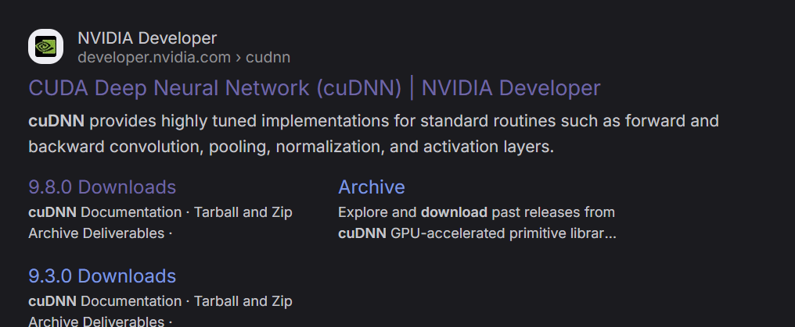
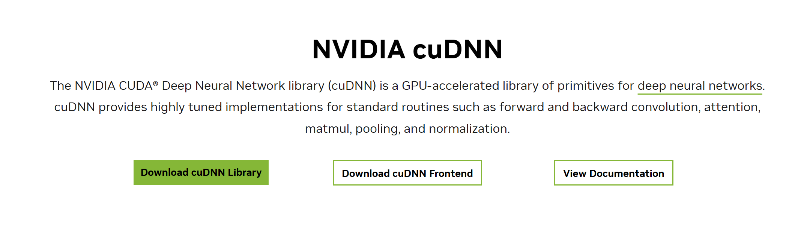
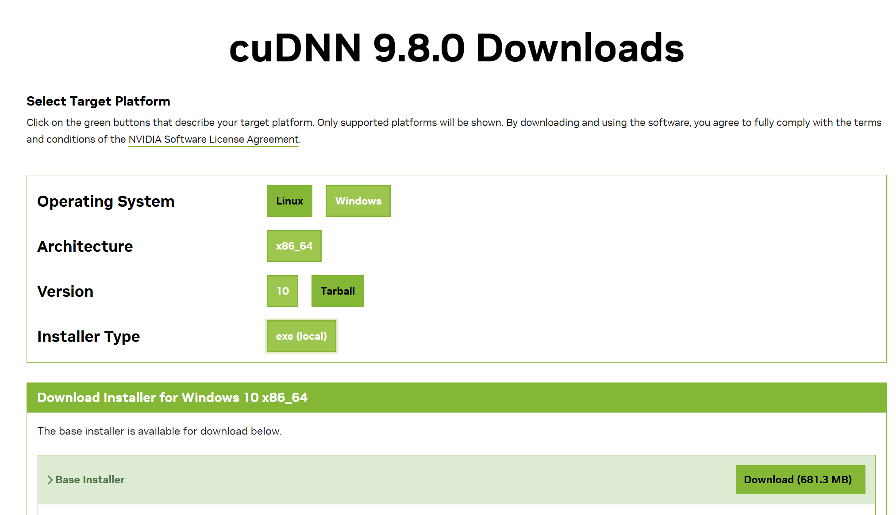
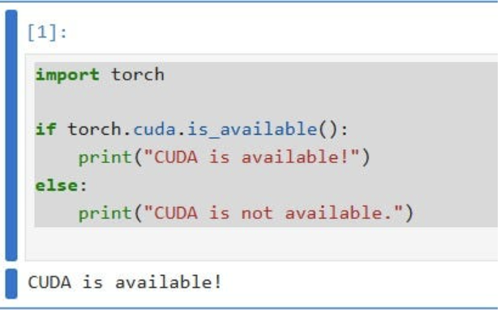
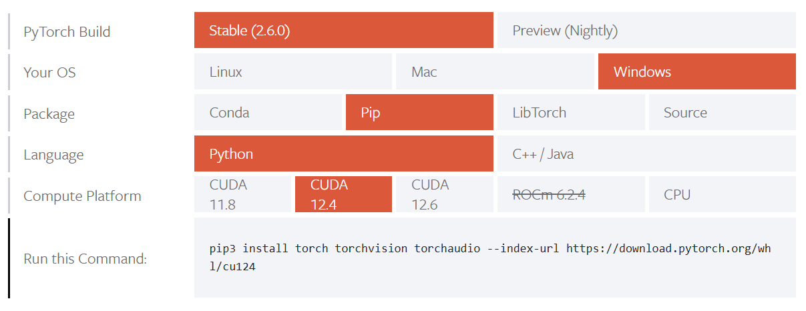
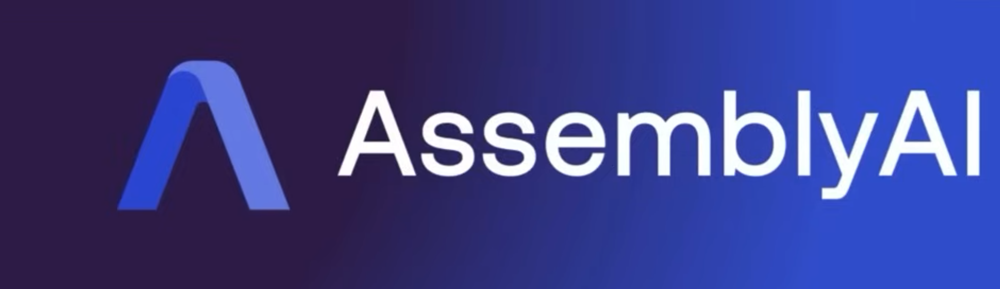

# 🚀 Run Unsloth on Windows & Fine-Tune LLMs Locally  
**Author**: Satwik Kishore  
**Date**: 06-04-25  

---

## 🧠 What is Fine-Tuning and Why is it Important?

**Fine-tuning** is the process of adapting a pre-trained large language model (LLM) for a specific task or domain. It updates the model’s internal parameters using **backpropagation**, enabling it to better handle targeted datasets or use cases.

### 🔍 Why is Fine-Tuning Crucial?

- **Enhancing Domain Knowledge**: Example – fine-tuning on medical texts improves healthcare-related responses.  
- **Customizing Behavior**: Control tone, style, or personality of the model – useful for chatbots or assistants.  
- **Optimizing for Specific Tasks**: Achieve better performance on tasks like sentiment analysis, legal review, or customer service.

---

## 💼 Example Use Cases of Fine-Tuning

- **Sentiment Analysis**: Understand how news impacts a company's image.  
- **Customer Interaction**: Personalized responses using historical data.  
- **Legal Research**: Analyze contracts, case law, and compliance documents.

---

## 💡 Why Fine-Tune Locally?

Earlier, fine-tuning LLMs like **LLaMA 3** or **Mistral** was possible only via cloud platforms like Google Colab – limited by:
- Internet dependence
- Privacy concerns
- Cost

With **Unsloth**, local fine-tuning is now fast and efficient:
- 🚀 Up to **5× faster training**  
- 💾 Up to **70% lower memory usage**  
- ✅ Now supports **Windows**

---

## 🖥️ Setup: Fine-Tune LLMs Locally on Windows

---

### ✅ Prerequisite: Python Version

- **Supported**: Python 3.10, 3.11, 3.12  
- ❌ **Not supported**: Python 3.13

```bash
python --version
```

---

## ⚙️ Step-by-Step Installation Guide

---

### 🔧 Step 1: Install Nvidia GPU Driver

Download from [Nvidia Driver Website](https://www.nvidia.com/Download/index.aspx) or install via **GeForce Experience**.


---

### 🛠️ Step 2: Install Visual Studio with C++ Components

Download: [Visual Studio Community Edition](https://visualstudio.microsoft.com/vs/community/)

Select the following components in the installer under **Individual Components**:
- .NET Framework 4.8 SDK  
- C++ Build Tools  
- Windows 10/11 SDK  
- MSBuild, LLVM, Clang, etc.

**Alternative via CMD**:
```bash
"C:\Program Files (x86)\Microsoft Visual Studio\Installer\vs_installer.exe" modify ^
--installPath "C:\Program Files\Microsoft Visual Studio\2022\Community" ^
--add Microsoft.Net.Component.4.8.SDK ^
--add Microsoft.Net.Component.4.7.2.TargetingPack ^
--add Microsoft.VisualStudio.Component.Roslyn.Compiler ^
--add Microsoft.Component.MSBuild ^
--add Microsoft.VisualStudio.Component.VC.Tools.x86.x64 ^
--add Microsoft.VisualStudio.Component.VC.Redist.14.Latest ^
--add Microsoft.VisualStudio.Component.VC.CMake.Project ^
--add Microsoft.VisualStudio.Component.VC.CLI.Support ^
--add Microsoft.VisualStudio.Component.VC.Llvm.Clang ^
--add Microsoft.VisualStudio.ComponentGroup.ClangCL ^
--add Microsoft.VisualStudio.Component.Windows11SDK.22621 ^
--add Microsoft.VisualStudio.Component.Windows10SDK.19041 ^
--add Microsoft.VisualStudio.Component.UniversalCRT.SDK ^
--add Microsoft.VisualStudio.Component.VC.Redist.MSM
```

---

### ⚡ Step 3: Install CUDA Toolkit & cuDNN

Download CUDA Toolkit: [CUDA Toolkit Archive](https://developer.nvidia.com/cuda-toolkit-archive)


Verify installation:
```bash
python -c "import torch; print(torch.cuda.is_available())"
```

Download cuDNN: [cuDNN Downloads](https://developer.nvidia.com/cudnn-downloads)


  


**Notebook Test**:
```python
import torch

if torch.cuda.is_available():
    print("CUDA is available!")
else:
    print("CUDA is not available.")
```



---

### 🧪 Step 4: Install PyTorch (CUDA Compatible)

Go to: [PyTorch Installation Guide](https://pytorch.org/get-started/locally/)

Example for CUDA 12.4:
```bash
pip3 install torch torchvision torchaudio --index-url https://download.pytorch.org/whl/cu124
```



---

### ⚙️ Step 5: Install Triton

Install Triton (required for Unsloth):
```bash
pip install -U triton-windows
```

✅ **Verify Installation**:
```python
import torch
import triton
import triton.language as tl

@triton.jit
def add_kernel(x_ptr, y_ptr, output_ptr, n_elements, BLOCK_SIZE: tl.constexpr):
    pid = tl.program_id(axis=0)
    block_start = pid * BLOCK_SIZE
    offsets = block_start + tl.arange(0, BLOCK_SIZE)
    mask = offsets < n_elements
    x = tl.load(x_ptr + offsets, mask=mask)
    y = tl.load(y_ptr + offsets, mask=mask)
    output = x + y
    tl.store(output_ptr + offsets, output, mask=mask)

def add(x: torch.Tensor, y: torch.Tensor):
    output = torch.empty_like(x)
    n_elements = output.numel()
    grid = lambda meta: (triton.cdiv(n_elements, meta["BLOCK_SIZE"]),)
    add_kernel[grid](x, y, output, n_elements, BLOCK_SIZE=1024)
    return output

a = torch.rand(3, device="cuda")
b = a + a
b_compiled = add(a, a)
print(b_compiled - b)
```

✅ Expected Output:
```
tensor([0., 0., 0.], device='cuda:0')
```

---

### 🔄 Step 6: Restart Your System

- Restart your laptop to apply all drivers and path settings.
- If errors persist, restart once again.

---

### 📦 Step 7: Install Unsloth

```bash
pip install "unsloth[windows] @ git+https://github.com/unslothai/unsloth.git"
```

---

### ⚠️ Note: Trainer Config

Avoid crashing by setting:
```python
trainer = SFTTrainer(
    dataset_num_proc=1,
    ...
)
```

---

## 🛠️ Advanced Troubleshooting

- Confirm `torch`, `triton`, `CUDA`, and `cuDNN` compatibility.  
- Use `nvcc` to verify CUDA is installed.  
- Check `xformers`:
```bash
python -m xformers.info
```

- Try installing [flash-attn](https://github.com/Dao-AILab/flash-attention) for better performance on Ampere GPUs.  
- Install `bitsandbytes`:
```bash
pip install bitsandbytes
python -m bitsandbytes
```

<strong>What is AssemblyAI and Why is it Useful?</strong>
AssemblyAI is a powerful AI speech-to-text API platform that allows developers to transcribe, understand, and analyze audio and video content using state-of-the-art deep learning models. It abstracts away the complexities of training and maintaining large-scale audio AI systems, making it easier for teams to integrate advanced voice intelligence into their applications.

## 🔊 **What is AssemblyAI and Why is it Useful?**

**AssemblyAI** is a powerful AI speech-to-text API platform that allows developers to transcribe, understand, and analyze audio and video content using state-of-the-art deep learning models. It abstracts away the complexities of training and maintaining large-scale audio AI systems, making it easier for teams to integrate advanced voice intelligence into their applications.

### 💡 **Here’s why AssemblyAI is valuable:**
- 🎯 **High-Accuracy Transcription**: Convert audio and video into accurate text using models trained on diverse, real-world datasets.
- ⚡ **Real-Time & Batch Processing**: Supports both real-time streaming transcription and batch file processing for flexibility in different use cases.
- 🧠 **Advanced Audio Intelligence**: Beyond transcription, AssemblyAI provides features like sentiment analysis, topic detection, entity recognition, and speaker diarization.
- 🔐 **Security & Compliance**: Offers enterprise-grade security features including data encryption, SOC 2 compliance, and more — crucial for handling sensitive information.

### 📌 **Example Use Cases of AssemblyAI:**
- 📞 **Call Center Analytics**: Transcribe and analyze customer calls for sentiment, keywords, and agent performance.
- 🎥 **Content Captioning**: Automatically generate captions for podcasts, videos, and livestreams.
- 🧾 **Compliance Monitoring**: Detect PII, risky language, and regulatory violations in finance or healthcare industries.
- 🗣️ **Voice-Controlled Apps**: Add voice-command capabilities to applications and services.




### <strong>🧠 What is This Flow Diagram Showing?</strong>  
This image illustrates the **Synthetic Data Generation Flow** using **Nemotron-4-340B** models developed by NVIDIA. It's a pipeline to generate, evaluate, and align high-quality AI training data.

---

### <strong>🔁 Step-by-Step Process:</strong>

- 👨‍💻 **Developer Input**  
  A developer submits a **domain-specific input query** to the system.

- 🧠 **Nemotron-4-340B Instruct**  
  The **Instruct model** generates **synthetic response data** based on the query.

- 📝 **Synthetic Response Data**  
  These responses simulate intelligent output which is then passed for evaluation.

- 🎯 **Nemotron-4-340B Reward**  
  The **Reward model** scores the synthetic responses based on quality and relevance.

- ✅ **Response Scores**  
  These scores help filter out weak responses and retain only the best ones.

- 🧹 **Filter Synthetic Responses**  
  Responses are filtered to ensure only high-quality data makes it through.

- 🗃️ **Synthetic Dataset**  
  The filtered responses are compiled into a dataset for training purposes.

- 🔧 **NeMo Aligner**  
  The dataset is used by **NeMo Aligner** to fine-tune and align models with expected outputs.

---

### <strong>🎯 Why It’s Useful:</strong>  
This method helps create large, high-quality datasets **without human labeling**, improving model performance with less manual effort.


### <strong>🤖 Types of Model Platforms for AI Development</strong>  
This image categorizes AI model platforms into **three main types** based on access level and customization freedom.

---

### <strong>🔒 Closed Source Model Platforms</strong>  
These platforms provide powerful models but with **limited transparency and control**.

- 🧠 <a href="https://openai.com/" target="_blank">OpenAI</a>  
- 🟤 <a href="https://www.anthropic.com/" target="_blank">Anthropic</a>

---

### <strong>🧪 Open Source Model Platforms</strong>  
Platforms offering **open models** that are community-driven and adaptable.

- 🤝 <a href="https://www.together.ai/" target="_blank">Together.ai</a>  
- 🔥 <a href="https://fireworks.ai/" target="_blank">Fireworks AI</a>

---

### <strong>🛠️ Train & Deploy Your Own Models</strong>  
Tools that allow developers to **train custom models** and deploy them with full control.

- 🚀 <a href="https://www.runpod.io/" target="_blank">RunPod</a>  
- ⚙️ <a href="https://modal.com/" target="_blank">Modal</a>

---


Here’s the structured breakdown for the image titled **“Fine-tune Claude 3 Haiku in Amazon Bedrock”**, just like before — with emojis, formatting, and the official link to the source:

---

### <strong>🛠️ Fine-Tuning in Closed Model Platforms</strong>  


#### <strong>📶 Task-Specific Performance (Ascending)</strong>

- 🧱 <strong>Base Model</strong>  
  The foundational, pre-trained model with general capabilities.

- 🧠 <strong>Prompt Engineering</strong>  
  Tailoring inputs (prompts) to better guide the model without changing its weights.

- 🎯 <strong>Fine-Tuned</strong>  
  The most specialized layer — model weights are adjusted using **custom data** to improve task-specific performance.

---


🔗 **Source:**  
👉 <a href="https://www.anthropic.com/index/fine-tune-claude-3-haiku-in-amazon-bedrock" target="_blank">Fine-tune Claude 3 Haiku in Amazon Bedrock – Anthropic (11 July 2024)</a>  


### 🔗 **Important Links for Fine-Tuning & Unsloth**  

- 🪟 **Windows Installation Guide (Unsloth Docs)**  
  📘 [https://docs.unsloth.ai/get-started/installing-+-updating/windows-installation](https://docs.unsloth.ai/get-started/installing-+-updating/windows-installation)

- 🧠 **Official GitHub Repository (Unsloth)**  
  🐙 [https://github.com/unslothai/unsloth?tab=readme-ov-file](https://github.com/unslothai/unsloth?tab=readme-ov-file)

  🚀 [https://unsloth.ai/](https://unsloth.ai/)

---
